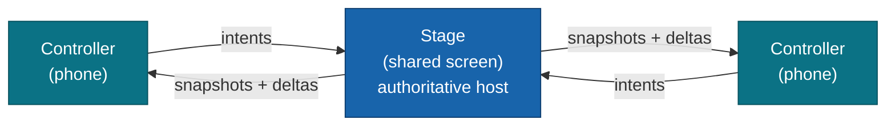

<div align="center">

# @moku-labs/room

**Couch multiplayer for Moku — one shared screen, phones as controllers, connected peer-to-peer over the LAN.**

`@moku-labs/room` is a Moku **framework** for local multiplayer: a shared screen hosts an authoritative game state,
phones join by scanning a QR code, and everything flows over **direct WebRTC DataChannels on the LAN** — no accounts,
no lobby servers. It is its own `@moku-labs/core` framework — you `createApp` from it. It is **not** a rendering/game
engine, and **not** a game server: gameplay is strictly peer-to-peer, with no relay and no TURN.

<br/>

[](https://www.npmjs.com/package/@moku-labs/room)
[](#requirements)
[](#requirements)
[](./LICENSE)

<br/>

[Install](#install) ·
[Why](#why-moku-labsroom) ·
[How it works](#how-it-works) ·
[Plugins](#plugins) ·
[Usage](#usage) ·
[Server core](#server-core-moku-labsroomserver) ·
[Scripts](#scripts)

</div>

---

## Install

```sh
bun add @moku-labs/room
```

> [!NOTE]
> **Status: `0.x` — early.** Room is a standalone Moku framework on `@moku-labs/core` (bundled, with `@moku-labs/common`
> supplying `ctx.log` / `ctx.env`); `trystero` (signaling) and `qrcode` (join QR) come bundled too. There is **no peer
> dependency** to install — `createApp` / `createPlugin` come from Room itself. The opt-in
> [server core](#server-core-moku-labsroomserver) runs on Cloudflare Workers (you supply `wrangler` + an account); it
> needs no extra package.

| Entry | For |
|---|---|
| `@moku-labs/room` | The **client core** — `createApp` for the browser couch game (also runs node tests). |
| `@moku-labs/room/server` | The **server core** — `createApp` for the opt-in Cloudflare Worker signaling tier (`hubPlugin` + the `Hub` Durable Object). |

## Why @moku-labs/room

- **Couch multiplayer, no server.** One shared screen hosts; phones join by QR and talk to it directly over WebRTC on
  the LAN. No accounts, no lobby backend, no relay carrying gameplay.
- **A framework, not a plugin pack.** Room is its own `@moku-labs/core` framework — one `createCoreConfig`, then you
  `createApp` from `@moku-labs/room` (client) or `@moku-labs/room/server` (worker). The four engines are wired as
  defaults; an app adds its role facade and game plugin. There are no role arrays — all plugins are uniform.
- **The host owns the truth.** The stage is the authoritative star hub: it validates controller intents, owns game
  state, and broadcasts snapshots + deltas back. Controllers render a strictly read-only replica.
- **Two planes, never crossed.** All gameplay rides the typed `Wire`; only coarse lifecycle (`room:*`) rides Moku
  `emit`. No gameplay payload ever touches the event bus.
- **Batteries-included defaults.** The verified "couch" profile — mandatory heartbeat, frame chunking, capped ICE
  recovery, 20–30 Hz state broadcast — ships on, so a stage/controller app needs **zero overrides**.

## How it works

A Room session has two device roles: the **stage** (the shared TV / laptop screen — the authoritative host that calls
`createRoom()`) and up to **eight controllers** (phones that `joinRoom(code)`). It is a **star topology** — every phone
connects only to the host; there are no controller↔controller channels.



The flow: `createRoom()` mints a 6-char code + join URL + QR → both devices meet on a public rendezvous (Trystero over
a Nostr backbone) → they exchange SDP/ICE in a **one-time handshake** → from then on they talk over **direct
peer-to-peer DataChannels on the LAN**. The rendezvous never carries gameplay; once connected, the relay is discarded.

**Two planes, kept strictly separate** — this is the contract: the **`Wire`** (`Frame` DataChannel) carries *all*
gameplay (intents, snapshots, deltas, heartbeats, recovery); Moku **`emit`** (`room:*`) carries *only* coarse
lifecycle. Nothing in `Frame` ever rides `emit`, and no `room:*` event ever carries gameplay.

> [!IMPORTANT]
> **No game server, no TURN — ever (accepted hard-failure risk, D2).** Room is strictly peer-to-peer. On AP-isolated /
> symmetric-NAT / iOS-Private-Relay networks (~15–30% in the wild) the P2P connection **cannot be established and there
> is no recovery path** — it hard-fails and surfaces `room:network-warning`. Room's design target is the **home LAN**
> (everyone in the same room on the same Wi-Fi); surface that event as failure UX. The opt-in
> [server core](#server-core-moku-labsroomserver) does **not** change this — it operates the *signaling / discovery*
> rendezvous only; gameplay stays strict P2P with no TURN and no relay.

> [!TIP]
> **iOS realities.** The app-layer heartbeat is **mandatory** (WebKit's DataChannel `onclose` doesn't fire on iOS, so
> dead peers are detected only by ping/pong). Opt into `requestWakeLock()` on the controller (Safari 16.4+) so the phone
> doesn't dim/lock and suspend its DataChannel. Host-reload recovery degrades to "rescan the QR to rejoin" on iOS.

## Plugins

Seven plugins. On the **client core** (`@moku-labs/room`), four are **engines** — wired as defaults — and two are
**role facades**: one ergonomic surface (`app.stage` / `app.controller`) over the engines, which an app adds via
`createApp({ plugins: [stagePlugin] })`. The seventh, **`hub`**, is the **server core**'s plugin
(`@moku-labs/room/server`), never composed on the client.

| # | Plugin | Tier | Wiring | Role / key surface |
|---|---|---|---|---|
| 1 | [`transportPlugin`](src/plugins/transport/README.md) | Complex | client default | WebRTC DataChannels: signaling handshake, chunking/backpressure, mandatory heartbeat, capped ICE recovery. Owns the typed `Wire`. Emits `room:network-warning`. |
| 2 | [`sessionPlugin`](src/plugins/session/README.md) | Complex | client default | Room code + QR + roster; star topology (`hostId()`); client-side host-reload recovery. Emits `room:peer-joined`, `room:peer-left`, `room:host-reconnecting`. |
| 3 | [`intentPlugin`](src/plugins/intent/README.md) | Standard | client default | Controller→host typed inputs (`IntentFrame`, per-controller `cSeq` idempotent de-dup). No events. |
| 4 | [`syncPlugin`](src/plugins/sync/README.md) | Complex | client default | Host→controller authoritative state: full snapshot + throttled op-list deltas. Emits `room:sync-ready`. |
| 5 | [`stagePlugin`](src/plugins/stage/README.md) | Standard (facade) | app-added (host) | **Host-role facade** → `StageApi` (`app.stage`). Re-declares all five `room:*` events. |
| 6 | [`controllerPlugin`](src/plugins/controller/README.md) | Standard (facade) | app-added (controller) | **Controller-role facade** → `ControllerApi` (`app.controller`). Re-declares all five `room:*` events. |
| 7 | [`hubPlugin`](src/plugins/hub/README.md) | Standard | **server core** default | The `@moku-labs/room/server` signaling tier — WS-Hibernation DO-per-room over the native Cloudflare `env` (DO + KV): handshake broker + in-band discovery + host-reload reclaim (no gameplay relay, D2). |

The facade **re-declares** all five `room:*` events for *compile-time visibility only* — a downstream game plugin
(`depends: [stagePlugin]` / `[controllerPlugin]`) then sees the complete typed hook surface in one edge. It installs no
forwarding hooks, because Moku's event bus is global and the engines' `emit("room:*")` already reaches every hook
regardless of `depends`.

## Usage

### Stage — the shared screen / host

```ts
import { createApp, createPlugin, stagePlugin } from "@moku-labs/room";

// Your game logic — depends on the facade so the five room:* events are visible.
const game = createPlugin("game", {
  depends: [stagePlugin],
  hooks: ctx => ({
    "room:peer-joined": ({ peerId }) => ctx.log.info(`controller joined: ${peerId}`),
    "room:network-warning": ({ reason }) => ctx.log.warn(`network: ${reason}`)
  })
});

// The four engines are core defaults; add the host facade + your game.
const app = createApp({ plugins: [stagePlugin, game] });
await app.start();

// createRoom() is SYNCHRONOUS — it returns the descriptor directly (no await).
const { code, joinUrl } = app.stage.createRoom();
showJoinCode(code, joinUrl);

// The join QR is async (descriptor.qr is always null) — fetch + render it from the qr() accessor.
const qr = await app.stage.qr();
if (qr) renderJoinQr(qr); // show on the TV; phones scan it to join

// Own authoritative state: react to a controller intent, mutate, sync broadcasts the delta.
app.stage.onIntent("score", (payload, peerId) => {
  app.stage.mutate("scores", draft => ({ ...draft, [peerId]: ((draft[peerId] as number) ?? 0) + 1 }));
});
```

`StageApi` (`app.stage`): `createRoom`, `qr`, `mutate`, `broadcast`, `onIntent`, `roster`.

### Controller — the phone

```ts
import { createApp, createPlugin, controllerPlugin } from "@moku-labs/room";

const pad = createPlugin("pad", {
  depends: [controllerPlugin],
  hooks: ctx => ({
    "room:sync-ready": () => ctx.log.info("replica is readable"),
    "room:host-reconnecting": () => ctx.log.info("host reloading — show reconnecting UX")
  })
});

const app = createApp({ plugins: [controllerPlugin, pad] });
await app.start();

// Join with the code scanned from the stage's QR. Throws on "full" | "not-found" | "unreachable".
await app.controller.joinRoom("K7P2Q9");
await app.controller.requestWakeLock(); // keep the phone screen awake for the session (iOS)

// Read the read-only replica + subscribe to changes.
const off = app.controller.on("round", round => render(round));

// Send a typed input to the host over the Wire (never emit).
app.controller.intent("move", { dx: 1, dy: 0 });
```

`ControllerApi` (`app.controller`): `joinRoom`, `read`, `on`, `intent`, `requestWakeLock`, `releaseWakeLock`.

### Choose a signaling adapter

The transport plugin's `signaling` config selects the rendezvous backbone. All three adapters are interchangeable
behind one type — swapping needs **zero** transport changes:

- **`publicRendezvous()`** — **default**. Trystero over a public Nostr backbone. Zero infra. Use in production.
- **`inMemory()`** — in-process, no `RTCPeerConnection`. Deterministic; use for tests / simulation.
  `inMemory({ server: true })` simulates the server protocol without a live Worker.
- **`serverSignaling(url)`** — **opt-in**, worker-backed. One persistent WebSocket to your own
  [server core](#server-core-moku-labsroomserver); enables in-band discovery + host-reload reclaim. Lazy-loaded — bundles
  that never call it pay nothing.

```ts
import { createApp, inMemory, stagePlugin } from "@moku-labs/room";

const app = createApp({
  plugins: [stagePlugin],
  pluginConfigs: { transport: { signaling: inMemory(), iceServers: [] } } // LAN-only, deterministic
});
```

## Server core (`@moku-labs/room/server`)

By default Room needs **no infrastructure** — `publicRendezvous()` brokers the handshake over public relays. The
`@moku-labs/room/server` entry is an **opt-in server core** for running the rendezvous yourself: a tiny Cloudflare
Worker with one **Durable Object per room**, reached from the browser through `serverSignaling(url)`.

> [!IMPORTANT]
> **This does not reintroduce a game server — D2 still holds.** The Worker brokers **signaling only**: the WebRTC
> handshake, in-band peer discovery, and host-reload reclaim. Once peers connect, **all gameplay still flows over direct
> P2P DataChannels and never touches the server** — the DO has **no relay path**. You're swapping the *rendezvous
> backbone* (public relays → your Worker), not adding a gameplay hop.

What it buys you over `publicRendezvous()`: **in-band discovery** (peer arrival/leave pushed from the DO, no public
backbone dependency), **host-reload reclaim** (the DO mints a `reclaimToken` on join; `session` persists it and replays
it on a host reload, so the **warm room survives** instead of opening fresh), and **room-teardown UX** (an idle room's
DO Alarm emits `{kind:"evict"}`, surfaced as `room:network-warning { reason: "room-evicted" }`).

Like every Moku framework, the server core **exports `createApp` — it never calls it**. The shape is **two files**: a
**root composition file** (`src/server.ts`) that creates the app once, and a **`cloudflare/` entry**
(`src/cloudflare/worker.ts`) that *uses* that app to wire the Worker — the `{ fetch }` default export + the `Hub`
binding. The app owns its `wrangler.jsonc` (D26).

```ts
// your-app/src/server.ts — the ROOT composition file: create the app once, export it.
import { createApp } from "@moku-labs/room/server";

export const app = createApp(); // the `hub` is wired by default
```

```ts
// your-app/src/cloudflare/worker.ts — the Cloudflare entry: USE the composed app to wire the Worker.
import { app } from "../server";

export { Hub } from "@moku-labs/room/server"; // re-export the DO class so wrangler can bind ROOM_HUB to it

export default {
  fetch: (req: Request, env: Record<string, unknown>, ctx: ExecutionContext) => app.hub.handle(req, env, ctx)
} satisfies ExportedHandler;
```

| Server export | What it is |
|---|---|
| `createApp` | The server core factory — wires the `hub` by default; `app.hub.handle(req, env, ctx)` is the request handler your `fetch` delegates to. |
| `Hub` | The `Hub` Durable Object class — re-export it from your worker entry so `wrangler` can bind `ROOM_HUB` to it. |
| `hubPlugin` | The `hub` plugin instance (already a server-core default; exported for custom composition). |
| `createPlugin` | Author a custom server plugin bound to Room's core. |

**Deploy — the consuming app owns deployment (D26).** Room ships **no `wrangler.jsonc`**. Point `main` at your
`cloudflare/worker.ts` and declare three bindings: `ROOM_HUB` (the DO + its SQLite migration), `RATE_LIMIT` (a KV
namespace for the per-IP join limit), and `ASSETS` (your built web client). The browser side just selects the adapter —
and should widen the room code on the public endpoint:

```ts
import { createApp, serverSignaling, stagePlugin } from "@moku-labs/room";

createApp({
  plugins: [stagePlugin],
  pluginConfigs: {
    transport: { signaling: serverSignaling("wss://room.example.com") },
    session: { codeLength: 8 } // ~57 bits — resist room-code enumeration of the public endpoint (D24)
  }
});
```

> [!NOTE]
> `tests/sandbox/wrangler.jsonc` is the reference shape for the bindings + migration, and the harness the worker
> Playwright e2e (`bun run test:e2e:worker`) drives over real `workerd`. See
> [`src/plugins/hub/README.md`](src/plugins/hub/README.md) for the full DO protocol, dispatch, and config.

## Events

The `room:*` plane is **coarse lifecycle only**. All gameplay rides the `Wire` (`Frame`s), never these events.

| Event | Payload | Emitted by | Meaning |
|---|---|---|---|
| `room:peer-joined` | `{ peerId }` | session | A controller's channel reached `connected` and was added to the roster. |
| `room:peer-left` | `{ peerId }` | session | A controller left or was declared dead by the heartbeat; removed from roster. |
| `room:host-reconnecting` | `{}` | session | Host tab reloaded; client-side recovery in flight — show "reconnecting" UX. |
| `room:sync-ready` | `{}` | sync | First full snapshot applied; the synced replica is now readable. |
| `room:network-warning` | `{ reason: "ice-failed" \| "rendezvous-unreachable" \| "channel-closed" \| "room-evicted" }` | transport | A connectivity hard-failure surfaced for failure UX (D2). `room-evicted` is server-core only — the `serverSignaling` DO's idle Alarm tore the room down. |

> [!NOTE]
> **Reload-path timing.** `room:host-reconnecting` is emitted during `session` init, before downstream consumer hooks
> register. On the reload path, poll `app.session.recoveryPhase()` in your own init/start (a non-`"stable"` phase means
> recovery is in flight) rather than relying on the event. The event remains useful for steady-state detection.

## Configuration

Every field has a safe default — the verified "couch" profile — so a stage/controller app needs **zero overrides**.
Override any engine field via `createApp({ pluginConfigs: { <plugin>: { … } } })`. The facades (`stage` / `controller`)
own no config; every knob lives on the engine that owns the concern. The complete field tables live in each engine's
README — [transport](src/plugins/transport/README.md), [session](src/plugins/session/README.md),
[intent](src/plugins/intent/README.md), [sync](src/plugins/sync/README.md). The most common overrides:

| Field | Engine | Default | Why you'd change it |
|---|---|---|---|
| `iceServers` | transport | one public STUN | `[]` forces LAN-only (mDNS). No TURN is ever added (D2). |
| `signaling` | transport | `publicRendezvous()` | Swap to `inMemory()` for tests, or `serverSignaling(url)` for the server core. |
| `maxControllers` | session | `8` | Cap simultaneous controllers (excludes host); lowering is fine. |
| `joinUrlBase` | session | `""` (uses `location.origin`) | Set the origin baked into the join URL / QR. |
| `codeLength` | session | `6` | Generated room-code length. Set `8` for `serverSignaling` deployments (D24). |
| `broadcastHz` | sync | `30` | Authoritative state broadcast rate. Verified safe band 20–30 Hz; clamped to `[5, 60]`. |

The server-core `hub` plugin has its own config (`doBinding`, `assetsBinding`, `rateLimit`, `joinWindowMs`,
`roomTtlMs`, …) — see [`src/plugins/hub/README.md`](src/plugins/hub/README.md).

## Scripts

```sh
bun run build              # bundle with tsdown (client `.` + server `./server` entries)
bun run test               # all tests (vitest)
bun run test:unit          # unit project only
bun run test:integration   # integration project only (inMemory signaling)
bun run test:coverage      # tests + coverage (90% threshold)
bun run test:e2e           # Playwright end-to-end (real-device interop — manual gate, not in CI)
bun run test:e2e:worker    # real wrangler dev + Playwright (server core) — manual gate, not in CI
bun run lint               # Biome check + ESLint
bun run lint:fix           # auto-fix Biome + ESLint
bun run format             # format with Biome
bun run typecheck          # tsc --noEmit ×2 (client graph + worker tsconfig)
bun run validate           # publint + attw (export-map / types correctness)
bun run sandbox            # serve tests/sandbox (manual two-device tryout)
bun run sandbox:worker     # serve the worker sandbox over wrangler dev (server core)
```

## Requirements

- **Node `>= 24`** and **Bun `>= 1.3.14`** — use `bun` exclusively (never npm/yarn/pnpm).
- **TypeScript** in strict mode, with `exactOptionalPropertyTypes` and `noUncheckedIndexedAccess`.
- **Built on [`@moku-labs/core`](https://github.com/moku-labs/core) + [`@moku-labs/common`](https://github.com/moku-labs/common)** — bundled dependencies (not peers); they supply the kernel and `ctx.log` / `ctx.env`.
- **The server core** runs on **Cloudflare Workers** (Durable Objects + KV) via your own `wrangler` config — no extra package, just an account.

## Docs

Per-plugin READMEs carry the full API shapes, config fields, and usage:

- [transport](src/plugins/transport/README.md) — WebRTC floor + `Wire` + signaling adapters.
- [session](src/plugins/session/README.md) — room code / QR / roster + host-reload recovery.
- [intent](src/plugins/intent/README.md) — controller→host typed inputs.
- [sync](src/plugins/sync/README.md) — authoritative state snapshot + deltas.
- [stage](src/plugins/stage/README.md) — host-role facade (`StageApi`).
- [controller](src/plugins/controller/README.md) — controller-role facade (`ControllerApi`).
- [hub](src/plugins/hub/README.md) — the **server core**'s signaling tier (`@moku-labs/room/server`): the
  `Hub` Durable Object + WS-Hibernation protocol + deployment.

The wire/signaling protocol (`Signaling`, `Wire`, every `Frame`, `Snapshot`, `Op`, `RosterEntry`, `MAX_CONTROLLERS`,
`ROOM_CODE_LENGTH`, …) lives in [`src/plugins/transport/protocol.ts`](src/plugins/transport/protocol.ts), and the
`RoomEvents` contract in [`src/config.ts`](src/config.ts).

## License

[MIT](./LICENSE) © [moku-labs](https://github.com/moku-labs)
