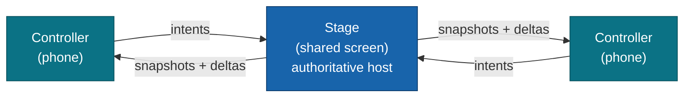

# @moku-labs/room

**Couch multiplayer for Moku — one shared screen, phones as controllers, connected peer-to-peer over the LAN.**

`@moku-labs/room` turns a shared screen and a handful of phones into a local multiplayer setup: the screen hosts an
authoritative game state, phones join by scanning a QR code, and everything flows over **direct WebRTC DataChannels on
the LAN** — no accounts, no lobby servers. It is **not** a standalone framework or app: it has no Layer-2 shell and
never calls `createApp` itself. You build a [`@moku-labs/web`](https://github.com/moku-labs/web) app and spread a
pre-composed Room plugin array into it — that is the whole integration model.

<br/>

[](https://www.npmjs.com/package/@moku-labs/room)
[](#requirements)
[](#requirements)
[](#requirements)
[](./LICENSE)

<br/>

[Install](#install) · [Why](#why-moku-labsroom) · [How it works](#how-it-works) · [Plugins](#plugins) · [Usage](#usage) · [Scripts](#scripts)

---

## Install

```sh
bun add @moku-labs/room @moku-labs/web
```

> [!NOTE]
> **Status: `0.x` — early.** `@moku-labs/web` (`^1.12.4`) is a **peer dependency** you install yourself — it supplies
> `createApp` / `createPlugin` and `ctx.log` / `ctx.env`. Room never imports `@moku-labs/core` directly. `trystero`
> (signaling) and `qrcode` (join QR) come bundled.

> [!IMPORTANT]
> In a browser app, import from **`@moku-labs/room/browser`** — the DOM/WebRTC build target. It exposes the identical
> surface as the main entry; the browser entry is the one a browser bundle should import.

| Entry | For |
|---|---|
| `@moku-labs/room` | Main entry — re-exports the full surface (Node / tooling / tests). |
| `@moku-labs/room/browser` | DOM/WebRTC build target — what a browser app imports. |

## Why @moku-labs/room

- **Couch multiplayer, no server.** One shared screen hosts; phones join by QR and talk to it directly over WebRTC on
  the LAN. No accounts, no lobby backend, no relay carrying gameplay.
- **A plugin pack, not a framework.** No `createApp` of its own, no Layer-2 shell — you spread `roomPlugins.stage` or
  `roomPlugins.controller` into *your* `@moku-labs/web` app. That spread is the entire contract.
- **The host owns the truth.** The stage is the authoritative star hub: it validates controller intents, owns game
  state, and broadcasts snapshots + deltas back. Controllers render a strictly read-only replica.
- **Two planes, never crossed.** All gameplay rides the typed `Wire`; only coarse lifecycle (`room:*`) rides Moku
  `emit`. No gameplay payload ever touches the event bus.
- **Batteries-included defaults.** The verified "couch" profile — mandatory heartbeat, frame chunking, capped ICE
  recovery, 20–30 Hz state broadcast — ships on, so composing a role array needs **zero overrides**.

## How it works

A Room session has two device roles: the **stage** (the shared TV / laptop screen — the authoritative host that calls
`createRoom()`) and up to **eight controllers** (phones that `joinRoom(code)`). It is a **star topology** — every phone
connects only to the host; there are no controller↔controller channels.



The flow: `createRoom()` mints a 6-char code + join URL + QR → both devices meet on a public rendezvous (Trystero over
a Nostr backbone) → they exchange SDP/ICE in a **one-time handshake** → from then on they talk over **direct
peer-to-peer DataChannels on the LAN**. The rendezvous never carries gameplay; once connected, the relay is discarded.

**Two planes, kept strictly separate** — this is the contract: the **`Wire`** (`Frame` DataChannel) carries *all*
gameplay (intents, snapshots, deltas, heartbeats, recovery); Moku **`emit`** (`room:*`) carries *only* coarse
lifecycle. Nothing in `Frame` ever rides `emit`, and no `room:*` event ever carries gameplay.

> [!IMPORTANT]
> **No game server, no TURN — ever (accepted hard-failure risk, D2).** Room is strictly peer-to-peer. On AP-isolated /
> symmetric-NAT / iOS-Private-Relay networks (~15–30% in the wild) the P2P connection **cannot be established and there
> is no recovery path** — it hard-fails and surfaces `room:network-warning`. Room's design target is the **home LAN**
> (everyone in the same room on the same Wi-Fi); surface that event as failure UX.

> [!TIP]
> **iOS realities.** The app-layer heartbeat is **mandatory** (WebKit's DataChannel `onclose` doesn't fire on iOS, so
> dead peers are detected only by ping/pong). Opt into `requestWakeLock()` on the controller (Safari 16.4+) so the phone
> doesn't dim/lock and suspend its DataChannel. Host-reload recovery degrades to "rescan the QR to rejoin" on iOS.

## Plugins

Six plugins, dependency-ordered. The first four are **engines**; the last two are **role facades** — one ergonomic
surface (`app.stage` / `app.controller`) over the four engines. Spread the matching pre-composed array into `createApp`:

```ts
roomPlugins.stage      = [transportPlugin, sessionPlugin, intentPlugin, syncPlugin, stagePlugin];
roomPlugins.controller = [transportPlugin, sessionPlugin, intentPlugin, syncPlugin, controllerPlugin];
```

| # | Plugin | Tier | Depends on | Role / key surface |
|---|---|---|---|---|
| 1 | [`transportPlugin`](src/plugins/transport/README.md) | Complex | — | WebRTC DataChannels: signaling handshake, chunking/backpressure, mandatory heartbeat, capped ICE recovery. Owns the typed `Wire`. Emits `room:network-warning`. |
| 2 | [`sessionPlugin`](src/plugins/session/README.md) | Complex | transport | Room code + QR + roster; star topology (`hostId()`); client-side host-reload recovery. Emits `room:peer-joined`, `room:peer-left`, `room:host-reconnecting`. |
| 3 | [`intentPlugin`](src/plugins/intent/README.md) | Standard | transport, session | Controller→host typed inputs (`IntentFrame`, per-controller `cSeq` idempotent de-dup). No events. |
| 4 | [`syncPlugin`](src/plugins/sync/README.md) | Complex | transport, session | Host→controller authoritative state: full snapshot + throttled op-list deltas. Emits `room:sync-ready`. |
| 5 | [`stagePlugin`](src/plugins/stage/README.md) | Standard (facade) | all four | **Host-role facade** → `StageApi` (`app.stage`). Re-declares all five `room:*` events. |
| 6 | [`controllerPlugin`](src/plugins/controller/README.md) | Standard (facade) | all four | **Controller-role facade** → `ControllerApi` (`app.controller`). Re-declares all five `room:*` events. |

The facade sits **last** in each array so it can re-declare all five `room:*` events and a downstream game plugin
(`depends: [stagePlugin]` / `[controllerPlugin]`) sees the complete typed hook surface in one edge. The facades
**re-declare** events for *compile-time visibility only* — they install no forwarding hooks, because Moku's event bus is
global and engines' `emit("room:*")` already reaches every hook regardless of `depends`.

## Usage

### Stage — the shared screen / host

```ts
import { createApp, createPlugin } from "@moku-labs/web/browser";
import { roomPlugins, stagePlugin } from "@moku-labs/room/browser";

// Your game logic — depends on the facade so the five room:* events are visible.
const game = createPlugin("game", {
  depends: [stagePlugin],
  hooks: ctx => ({
    "room:peer-joined": ({ peerId }) => ctx.log.info(`controller joined: ${peerId}`),
    "room:network-warning": ({ reason }) => ctx.log.warn(`network: ${reason}`)
  })
});

const app = createApp({ plugins: [...roomPlugins.stage, game] });
await app.start();

// createRoom() is SYNCHRONOUS — it returns the descriptor directly (no await).
const { code, joinUrl } = app.stage.createRoom();
showJoinCode(code, joinUrl);

// The join QR is async (descriptor.qr is always null) — fetch + render it from the qr() accessor.
const qr = await app.stage.qr();
if (qr) renderJoinQr(qr); // show on the TV; phones scan it to join

// Own authoritative state: react to a controller intent, mutate, sync broadcasts the delta.
app.stage.onIntent("score", (payload, peerId) => {
  app.stage.mutate("scores", draft => ({ ...draft, [peerId]: ((draft[peerId] as number) ?? 0) + 1 }));
});
```

`StageApi` (`app.stage`): `createRoom`, `qr`, `mutate`, `broadcast`, `onIntent`, `roster`.

### Controller — the phone

```ts
import { createApp, createPlugin } from "@moku-labs/web/browser";
import { roomPlugins, controllerPlugin } from "@moku-labs/room/browser";

const pad = createPlugin("pad", {
  depends: [controllerPlugin],
  hooks: ctx => ({
    "room:sync-ready": () => ctx.log.info("replica is readable"),
    "room:host-reconnecting": () => ctx.log.info("host reloading — show reconnecting UX")
  })
});

const app = createApp({ plugins: [...roomPlugins.controller, pad] });
await app.start();

// Join with the code scanned from the stage's QR. Throws on "full" | "not-found" | "unreachable".
await app.controller.joinRoom("K7P2Q9");
await app.controller.requestWakeLock(); // keep the phone screen awake for the session (iOS)

// Read the read-only replica + subscribe to changes.
const off = app.controller.on("round", round => render(round));

// Send a typed input to the host over the Wire (never emit).
app.controller.intent("move", { dx: 1, dy: 0 });
```

`ControllerApi` (`app.controller`): `joinRoom`, `read`, `on`, `intent`, `requestWakeLock`, `releaseWakeLock`.

### Choose a signaling adapter

The transport plugin's `signaling` config selects the rendezvous backbone:

- **`publicRendezvous()`** — **default**. Trystero over a public Nostr backbone. Use in production.
- **`inMemory()`** — in-process, no `RTCPeerConnection`. Deterministic; use for tests / simulation.

```ts
import { createApp } from "@moku-labs/web/browser";
import { roomPlugins, inMemory } from "@moku-labs/room";

const app = createApp({
  plugins: roomPlugins.stage,
  pluginConfigs: { transport: { signaling: inMemory(), iceServers: [] } } // LAN-only, deterministic
});
```

## Events

The `room:*` plane is **coarse lifecycle only**. All gameplay rides the `Wire` (`Frame`s), never these events.

| Event | Payload | Emitted by | Meaning |
|---|---|---|---|
| `room:peer-joined` | `{ peerId }` | session | A controller's channel reached `connected` and was added to the roster. |
| `room:peer-left` | `{ peerId }` | session | A controller left or was declared dead by the heartbeat; removed from roster. |
| `room:host-reconnecting` | `{}` | session | Host tab reloaded; client-side recovery in flight — show "reconnecting" UX. |
| `room:sync-ready` | `{}` | sync | First full snapshot applied; the synced replica is now readable. |
| `room:network-warning` | `{ reason: "ice-failed" \| "rendezvous-unreachable" \| "channel-closed" }` | transport | A connectivity hard-failure surfaced for failure UX (D2). |

> [!NOTE]
> **Reload-path timing.** `room:host-reconnecting` is emitted during `session` init, before downstream consumer hooks
> register. On the reload path, poll `app.session.recoveryPhase()` in your own init/start (a non-`"stable"` phase means
> recovery is in flight) rather than relying on the event. The event remains useful for steady-state detection.

## Configuration

Every field has a safe default — the verified "couch" profile — so composing `roomPlugins.stage` /
`roomPlugins.controller` needs **zero overrides**. Override any engine field via
`createApp({ pluginConfigs: { <plugin>: { … } } })`. The facades (`stage` / `controller`) own no config; every knob
lives on the engine that owns the concern. The complete field tables live in each engine's README —
[transport](src/plugins/transport/README.md), [session](src/plugins/session/README.md),
[intent](src/plugins/intent/README.md), [sync](src/plugins/sync/README.md). The most common overrides:

| Field | Engine | Default | Why you'd change it |
|---|---|---|---|
| `iceServers` | transport | one public STUN | `[]` forces LAN-only (mDNS). No TURN is ever added (D2). |
| `signaling` | transport | `publicRendezvous()` | Swap to `inMemory()` for tests / simulation. |
| `maxControllers` | session | `8` | Cap simultaneous controllers (excludes host); lowering is fine. |
| `joinUrlBase` | session | `""` (uses `location.origin`) | Set the origin baked into the join URL / QR. |
| `broadcastHz` | sync | `30` | Authoritative state broadcast rate. Verified safe band 20–30 Hz; clamped to `[5, 60]`. |

## Scripts

```sh
bun run build              # bundle with tsdown
bun run test               # all tests (vitest)
bun run test:unit          # unit project only
bun run test:integration   # integration project only (inMemory signaling)
bun run test:coverage      # tests + coverage (90% threshold)
bun run test:e2e           # Playwright end-to-end
bun run lint               # Biome check + ESLint
bun run lint:fix           # auto-fix Biome + ESLint
bun run format             # format with Biome
bun run typecheck          # tsc --noEmit
bun run validate           # publint + attw (export-map / types correctness)
bun run sandbox            # serve tests/sandbox (manual two-device tryout)
```

## Requirements

- **Node `>= 24`** and **Bun `>= 1.3.14`** — use `bun` exclusively (never npm/yarn/pnpm).
- **TypeScript** in strict mode, with `exactOptionalPropertyTypes` and `noUncheckedIndexedAccess`.
- **[`@moku-labs/web`](https://github.com/moku-labs/web) `^1.12.4`** — peer dependency; supplies `createApp` /
  `createPlugin` and `ctx.log` / `ctx.env`. Room never imports `@moku-labs/core` directly.

## Docs

Per-plugin READMEs carry the full API shapes, config fields, and usage:

- [transport](src/plugins/transport/README.md) — WebRTC floor + `Wire` + signaling adapters.
- [session](src/plugins/session/README.md) — room code / QR / roster + host-reload recovery.
- [intent](src/plugins/intent/README.md) — controller→host typed inputs.
- [sync](src/plugins/sync/README.md) — authoritative state snapshot + deltas.
- [stage](src/plugins/stage/README.md) — host-role facade (`StageApi`).
- [controller](src/plugins/controller/README.md) — controller-role facade (`ControllerApi`).

Shared contract types (`Signaling`, `Wire`, every `Frame`, `RoomEvents`, `Snapshot`, `Op`, `RosterEntry`,
`MAX_CONTROLLERS`, `ROOM_CODE_LENGTH`, …) live in [`src/contracts.ts`](src/contracts.ts).

## License

[MIT](./LICENSE) © [moku-labs](https://github.com/moku-labs)
